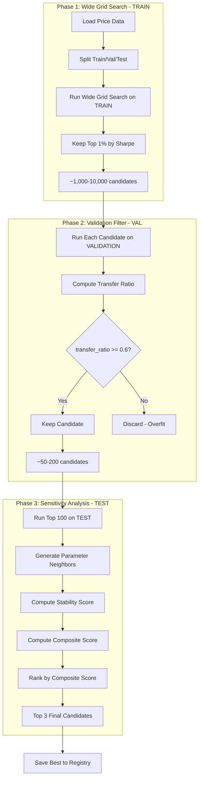

# Codebase Reorganization & Automated Optimization Pipeline

This plan covers two major improvements:

1. Asset-centric folder structure to reduce clutter
2. Automated single-asset optimization with robust parameter selection

---

## Part 1: Codebase Reorganization

### Current Problems

- Config explosion: `GOOG_FINAL.yml`, `ETH_FINAL.yml`, `wide.yml`, etc.
- Data clutter: `GOOG_ema.parquet`, `VOO_macd.parquet` scattered in `data/`
- Cache files: CSVs in `data/cache/` with inconsistent naming

### New Folder Structure

```javascript
PickleRickTrading/
├── assets/
│   ├── GOOG/
│   │   ├── config.yml           # Current optimized params for this asset
│   │   ├── cache.csv            # Price data cache
│   │   └── results/             # Grid search results
│   │       └── ensemble_wide_2024-12-18.parquet
│   ├── BTC/
│   │   ├── config.yml
│   │   ├── cache.csv
│   │   └── results/
│   └── ... (one folder per asset)
│
├── templates/                   # Reusable grid search templates
│   ├── wide_ensemble_grid.yml
│   ├── wide_ema_grid.yml
│   └── wide_macd_grid.yml
│
├── portfolios/                  # Multi-asset portfolio configs
│   └── momentum_top5.yml
│
├── registry.yml                 # Single source of truth for all optimized assets
│
├── backtesting/                 # Existing module (unchanged)
├── main.py                      # CLI entry point
└── ...
```


### Registry File Format

Single file replaces all `*_FINAL.yml` configs:

```yaml
# registry.yml
assets:
  GOOG:
    strategy: ensemble_unconstrained
    params:
      ema_fast: 7
      ema_mid: 73
      ema_slow: 217
      fastperiod: 85
      slowperiod: 92
      signalperiod: 7
    last_optimized: "2024-12-15"
    train_sharpe: 1.42
    val_sharpe: 1.15
    test_sharpe: 0.89
    stability_score: 0.85
    
  BTC:
    strategy: ensemble_unconstrained
    params: {...}
    ...
```

Portfolio configs then reference tickers from registry instead of duplicating params inline.

### Files to Modify

- [backtesting/config.py](backtesting/config.py) - Add registry loading logic
- [backtesting/data/fetcher.py](backtesting/data/fetcher.py) - Update cache path resolution
- [main.py](main.py) - Update CLI to work with new paths

### Migration Script

Create a one-time script to move existing files:

- `data/cache/*.csv` -> `assets/{TICKER}/cache.csv`
- `data/*.parquet` -> `assets/{TICKER}/results/`
- `config/*_FINAL.yml` -> Merge into `registry.yml`

---

## Part 2: Automated Optimization Pipeline

### Data Split Strategy

```javascript
|-------- TRAIN (60%) --------|---- VALIDATION (20%) ----|---- TEST (20%) ----|
        Grid search                Filter overfit              Sensitivity
        (optimize here)            (check transfer)            (final confirm)
```


- **TRAIN**: Run wide grid search, generate millions of combinations
- **VALIDATION**: Filter out overfit parameters (touch repeatedly during dev)
- **TEST**: Final confirmation + sensitivity analysis (touch ONCE at end)

### 3-Phase Pipeline




### Key Metrics and Scoring

| Metric | Formula | Purpose ||--------|---------|---------|| Transfer Ratio | `val_sharpe / train_sharpe` | Detects overfitting || Consistency | `min(train, val, test) / max(train, val, test)` | Rewards stable performance || Stability Score | `min(neighbor_sharpes) / original_sharpe` | Rewards robust parameters || Composite Score | `test_sharpe * consistency * stability` | Final ranking |

### Sensitivity Analysis

For each candidate, perturb parameters within a neighborhood:

- Step size: +/- 1, +/- 2 for each parameter
- Compute Sharpe for all neighbors on TEST data
- Stability = how much Sharpe degrades for worst neighbor

Parameters that collapse when nudged = fragile = discard.

### New CLI Command

```bash
python main.py optimize --ticker GOOG --strategy ensemble_unconstrained --save
```

Pipeline steps:

1. Resolve paths: `assets/GOOG/cache.csv`, template from `templates/`
2. Load data, split 50/25/25
3. Phase 1: Wide grid on TRAIN -> top 1%
4. Phase 2: Run on VAL -> filter by transfer ratio >= 0.6
5. Phase 3: Sensitivity on TEST -> compute composite scores
6. Print top 3 candidates with all metrics
7. If `--save`: Write best to `registry.yml`

### Files to Create/Modify

| File | Action ||------|--------|| `backtesting/optimizer.py` | NEW - Core optimization pipeline logic || `backtesting/config.py` | Add `split_train_val_test()`, registry helpers || `main.py` | Add `optimize` subcommand || `templates/wide_ensemble_grid.yml` | NEW - Default wide grid ranges |

### Configurable Thresholds

```yaml
# In template or CLI args
optimization:
  train_ratio: 0.50
  val_ratio: 0.25
  test_ratio: 0.25
  top_percent_phase1: 0.01        # Keep top 1% from grid search
  transfer_ratio_threshold: 0.6   # Min val/train ratio
  sensitivity_step: 2             # Neighbor step size
  final_candidates: 3             # How many to return
```

---

## Implementation Order

1. **Reorganize folder structure** - Create migration script, update path resolution
2. **Implement 3-way data split** - Modify `split_train_val()` in [backtesting/data/fetcher.py](backtesting/data/fetcher.py)
3. **Create optimizer module** - New `backtesting/optimizer.py` with 3-phase logic
4. **Add composite scoring** - Transfer ratio, stability score, final composite